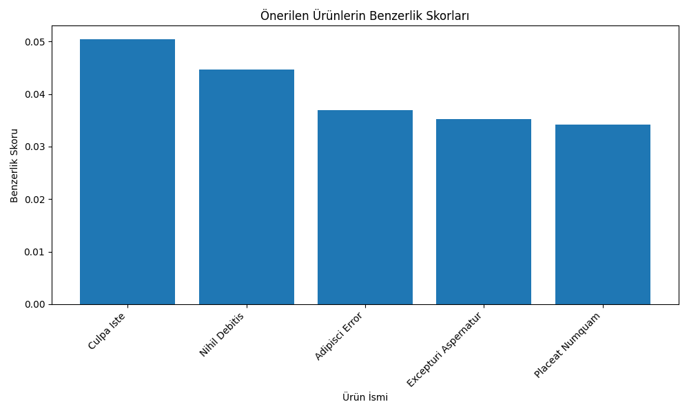
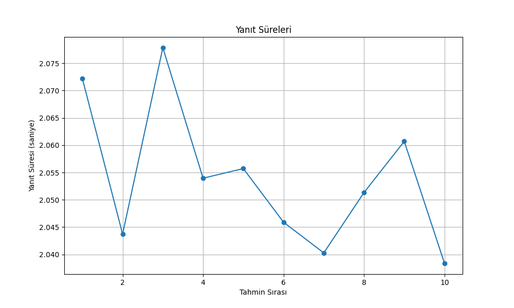

# E-ticaret Ürün Öneri Sistemi 🛒

## Proje Özeti

Bu proje, MLflow kullanarak bir e-ticaret ürün öneri sistemi geliştirmeyi, deployment süreçlerini yönetmeyi ve REST API aracılığıyla servis etmeyi göstermektedir. Sistem, kullanıcı-ürün etkileşimlerini analiz ederek kişiselleştirilmiş öneriler sunmaktadır.

## 🔧 Kurulum

### Gereksinimler

```bashF
pip install -r requirements.txt
```

Başlıca gereksinimler:
- mlflow==2.10.0
- fastapi==0.104.1
- uvicorn==0.24.0
- pandas==2.1.0
- numpy==1.25.2
- scikit-learn==1.2.2
- joblib==1.3.2

### Veri Oluşturma

```bash
python generate_data.py
```

Bu komut, `data/` klasörü altında şu dosyaları oluşturur:
- `users.csv`: Kullanıcı profilleri
- `products.csv`: Ürün bilgileri
- `interactions.csv`: Kullanıcı-ürün etkileşimleri

### MLflow Sunucusunu Başlatma

```bash
mlflow server --host 0.0.0.0 --port 5000
```

Bu komut, MLflow sunucusunu `http://localhost:5000` adresinde başlatır.

### Model Eğitimi

```bash
# Temel model eğitimi (Kosinüs benzerliği)
python train_recommendation.py

# Öklid uzaklığı bazlı model
python train_recommendation.py --model_type euclidean

# Manhattan uzaklığı bazlı model
python train_recommendation.py --model_type manhattan

# Minimum derecelendirme filtreli model
python train_recommendation.py --min_rating 3

# Normalizasyon olmadan model
python train_recommendation.py --normalize False

# Özel versiyon adı ile model
python train_recommendation.py --model_type euclidean --version_suffix test1
```

Bu script:
1. Sentetik veriyi yükler
2. Kullanıcı-ürün matrisini oluşturur
3. Seçilen benzerlik metriğine göre ürün benzerlik matrislerini hesaplar:
   - Kosinüs benzerliği (varsayılan)
   - Öklid uzaklığı
   - Manhattan uzaklığı
4. Veri önişleme seçeneklerini uygular:
   - Minimum derecelendirme filtresi (opsiyonel)
   - Kullanıcı ortalamalarına göre normalizasyon (varsayılan: açık)
5. Modeli değerlendirir (RMSE, MAE)
6. Model ve artifactları MLflow'a kaydeder

Her model eğitimi sonunda:
- MLflow'da farklı bir versiyon olarak kaydedilir
- Versiyon adında kullanılan parametreler görünür (örn: v1_20240318_123456_euclidean_minrating3)
- Model performans metrikleri karşılaştırılabilir

### API Servisini Başlatma

```bash
python serve.py
```

Servis şu adreste çalışacaktır: `http://localhost:8000`

## 📋 Kullanım Kılavuzu

### API Endpoint'leri

| Endpoint | Yöntem | Açıklama |
|----------|--------|----------|
| `/` | GET | API bilgileri |
| `/versions` | GET | Mevcut tüm model versiyonlarını ve hangi endpoint için kullanıldığını listeler |
| `/load_recommendation_version/{version_name}` | POST | Belirli bir öneri model versiyonunu yükler |
| `/load_rating_version/{version_name}` | POST | Belirli bir derecelendirme model versiyonunu yükler |
| `/recommend` | POST | Ürün önerileri sunar |
| `/predict` | POST | Kullanıcı-ürün derecelendirme tahmini yapar |
| `/recommendation_model_health` | GET | Öneri modelinin sağlık durumunu kontrol eder |
| `/rating_model_health` | GET | Derecelendirme modelinin sağlık durumunu kontrol eder |
| `/metrics` | GET | Sistem metriklerini ve model performansını gösterir |
| `/item/{item_id}` | GET | Ürün detaylarını getirir |
| `/items` | GET | Birden fazla ürünün detaylarını getirir |
| `/user_interactions/{user_id}` | GET | Kullanıcının etkileşimlerini getirir |
| `/popular_items` | GET | En popüler ürünleri getirir |
| `/delete_model_version/{version_name}` | DELETE | Belirtilen model versiyonunu siler |

### Ürün-tabanlı Öneri İsteği

```bash
curl -X 'POST' \
  'http://localhost:8000/recommend' \
  -H 'accept: application/json' \
  -H 'Content-Type: application/json' \
  -d '{
       "user_id": 123,
       "item_id": 42,
       "num_recommendations": 5
   }'
```

### Kullanıcı-tabanlı Öneri İsteği

```bash
curl -X 'POST' \
  'http://localhost:8000/recommend' \
  -H 'accept: application/json' \
  -H 'Content-Type: application/json' \
  -d '{
       "user_id": 123,
       "num_recommendations": 5
   }'
```

### Model Versiyonları Arası Geçiş

```bash
curl -X 'POST' \
  'http://localhost:8000/load_recommendation_version/v1_20250318_122143' \
  -H 'accept: application/json'
```

Versiyon adını MLflow arayüzünden (`http://localhost:5000`) bulabilirsiniz.

### Derecelendirme Tahmini İsteği

```bash
curl -X 'POST' \
  'http://localhost:8000/predict' \
  -H 'accept: application/json' \
  -H 'Content-Type: application/json' \
  -d '{
       "user_id": 123,
       "item_id": 42,
       "user_age": 25,
       "user_gender": "F",
       "item_category": "Elektronik",
       "item_price": 999.99
   }'
```

### Ürün Detayları İsteği

```bash
# Tek ürün detayı
curl -X 'GET' 'http://localhost:8000/item/42'

# Birden fazla ürün detayı
curl -X 'GET' 'http://localhost:8000/items?ids=42,43,44'
```

### Kullanıcı Etkileşimleri İsteği

```bash
# Tüm etkileşimler
curl -X 'GET' 'http://localhost:8000/user_interactions/123'

# Sıralama ve limit ile
curl -X 'GET' 'http://localhost:8000/user_interactions/123?limit=10&sort_by=rating&order=desc'
```

### Popüler Ürünler İsteği

```bash
curl -X 'GET' 'http://localhost:8000/popular_items?limit=10'
```

### Sistem Metrikleri İsteği

```bash
# Tüm sistem metrikleri
curl -X 'GET' 'http://localhost:8000/metrics'

# Belirli bir model versiyonunun metrikleri
curl -X 'GET' 'http://localhost:8000/metrics?version_name=v1_auto_select'
```

### Model Silme İsteği

```bash
# Normal silme
curl -X 'DELETE' 'http://localhost:8000/delete_model_version/v1_test'

# Zorla silme (aktif kullanımdaki model için)
curl -X 'DELETE' 'http://localhost:8000/delete_model_version/v1_test?force=true'
```

## 🧪 Test Etme

Sistemin doğru çalıştığını ve performansını doğrulamak için iki farklı test scripti bulunmaktadır:

### Öneri Sistemi Testleri

```bash
python test_recommendation.py
```

Bu script şunları test eder:
- **Model Sağlık Durumu:** Öneri modelinin sağlık durumunu kontrol eder, metriklerini ve model bilgilerini raporlar.
- **Model Versiyonları:** Mevcut tüm model versiyonlarını ve endpoint bilgilerini listeler.
- **Ürün-tabanlı Öneriler:** Belirli bir ürüne benzeyen diğer ürünleri test eder ve benzerlik skorlarını grafikleştirir.
- **Kullanıcı-tabanlı Öneriler:** Kullanıcı geçmişine göre önerileri test eder ve tahmin puanlarını grafikleştirir.

Her test, ayrıntılı rapor dosyaları (`*_test_report_*.txt`) ve görsel grafikler (`*.png`, `*.pdf`) oluşturur:
- Benzerlik grafiği (`item_similarity_*.png`)
- Tahmin skorları grafiği (`user_predictions_*.png`)
- Versiyon karşılaştırma grafikleri (`version_comparison_*.png`)

#### Örnek Test Raporu ve Grafikler

**Ürün Benzerlik Grafiği:**


Bu grafik, test edilen ürüne en benzer 5 ürünün benzerlik skorlarını gösterir. Yüksek benzerlik skorları (0.7-0.9 arası) iyi öneriler anlamına gelir.

**Farklı Model Versiyonları Karşılaştırması:**

Kosinüs benzerliği ve Öklid uzaklığı modellerinden elde edilen ürün benzerlikleri karşılaştırıldığında farklı skorlar görünür:
- Kosinüs benzerliği daha yüksek skorlar gösterir (0.7-0.9 aralığında)
- Öklid uzaklığı daha düşük skorlar gösterir (0.5-0.7 aralığında)
- Kosinüs benzerliğinde skorlar daha yakın ve ayırt edicilik daha azdır
- Öklid uzaklığında skorlar arasında daha belirgin farklar görülür

Ürünlerin genel benzerliğini ölçmek için kosinüs benzerliği, belirli özelliklere (fiyat, kategori) göre benzerliği ölçmek için Öklid uzaklığı daha uygundur.

### Tahmin Sistemi Testleri

```bash
python test_predictions.py
```

Bu script aşağıdaki testleri gerçekleştirir:
- **Rastgele Tahmin İstekleri:** Farklı kullanıcı ve ürün kombinasyonlarıyla tahmin işlemlerini test eder.
- **Performans İzleme:** Yanıt sürelerini ölçer ve her isteğin başarı durumunu kaydeder.
- **Sonuç Analizi:** Tahmin dağılımlarını analiz eder ve görselleştirir.

Test sonuçları aşağıdaki dosyalarda raporlanır:
- Ayrıntılı test raporu (`prediction_test_report_*.txt`)
- Tahmin dağılımı grafiği (`prediction_distribution_*.png`)
- Yanıt süreleri grafiği (`response_times_*.png`)

#### Örnek Test Çıktıları ve Analizleri

**Tahmin Dağılımı Grafiği:**


Bu grafik, tahmin değerlerinin frekans dağılımını gösterir. İdeal bir tahmin modelinde çan eğrisi şeklinde bir dağılım (1-5 arasında yayılmış) beklenir. Yukarıdaki grafikte tahminlerin çoğunlukla 3.0 civarında toplanması, modelin çeşitlilik göstermediğini ve daha fazla iyileştirme gerektiğini belirtir.

**Yanıt Süreleri Grafiği:**


Bu grafik, her tahmin isteğinin işlenme süresini gösterir. İlk istek genellikle daha uzun sürer (model yüklemesi nedeniyle), sonraki istekler daha hızlı olmalıdır. Grafikteki yanıt sürelerinde ilk istek için yaklaşık 20 saniye, sonraki isteklerde ise ortalama 2 saniye civarında bir süre görülmektedir.

### Test Raporları

Tüm test çıktıları `test_reports/` klasöründe tarihe göre düzenlenmiş alt klasörlerde saklanır:
- Öneri testleri: `test_reports/recommendation_tests/run_*/`
- Tahmin testleri: `test_reports/prediction_tests/run_*/`

Her test çalıştırmasında yeni bir zaman damgalı klasör oluşturulur ve tüm raporlar ve grafikler bu klasörde saklanır. Bu sayede farklı zamanlarda yapılan testleri karşılaştırmak mümkün olur.

### Test Sonuçlarını Yorumlama

**Başarılı bir test şu özellikleri gösterir:**

- **Tahmin Testi:**
  - Yüksek başarı oranı (%95+)
  - Düşük yanıt süreleri (< 1 saniye)
  - 1-5 arasında dağılmış gerçekçi tahminler
  - Makul standart sapma değerleri

- **Öneri Testi:**
  - Benzer kategoride ve fiyatta ürün önerileri
  - Yüksek benzerlik skorları (0.6+)
  - Kullanıcı profiline uygun çeşitli öneriler

**Sorunlu durumlar şunlar olabilir:**
- Tek bir değere yığılmış tahminler (yukarıdaki örnekte olduğu gibi)
- Uzun yanıt süreleri (ilk yükleme hariç 1 saniyeden fazla)
- Düşük benzerlik skorları (< 0.4)
- Alakasız ürün önerileri

Testleri düzenli olarak çalıştırarak ve sonuçları analiz ederek, sistemin performansını ve öneri kalitesini sürekli olarak izleyebilir ve iyileştirebilirsiniz.

## 📊 Loglama ve Raporlama

### Loglama Sistemi

Sistem, detaylı ve yapılandırılabilir bir loglama mekanizmasına sahiptir:

```bash
# Logger kurulumu
from logger import setup_logger

logger = setup_logger(
    name="test_name",
    level="debug",
    log_dir="logs/test_dir",
    json_output=False
)
```

#### Log Seviyeleri
- **DEBUG:** Detaylı geliştirme bilgileri
- **INFO:** Genel bilgilendirme mesajları
- **WARNING:** Potansiyel sorunlar
- **ERROR:** Hata durumları
- **CRITICAL:** Kritik sistem sorunları

#### Log Dosya Yapısı
```
logs/
├── prediction_tests/      # Tahmin testleri logları
│   └── test_20250321.log
└── recommendation_tests/  # Öneri testleri logları
    └── test_20250321.log
```

### Raporlama Sistemi

Test raporları `test_reports/` klasöründe organize edilir:

```
test_reports/
├── prediction_tests/
│   └── run_20250321_122454/
│       ├── prediction_distribution_*.png
│       ├── response_times_*.png
│       └── prediction_test_report_*.txt
└── recommendation_tests/
    └── run_20250321_114717/
        ├── item_based/
        │   ├── item_similarity_*.png
        │   └── item_test_report_*.txt
        ├── user_based/
        │   ├── user_predictions_*.png
        │   └── user_test_report_*.txt
        └── test_summary_*.txt
```

#### Rapor Türleri

1. **Test Özet Raporu:**
   - Test tarihi
   - Başarı oranları
   - Oluşturulan raporların listesi
   - Dosya boyutları

2. **Model Sağlık Raporu:**
   - Model versiyonu ve durumu
   - Performans metrikleri (RMSE, MAE)
   - Sistem kullanım istatistikleri

3. **Görsel Raporlar:**
   - Tahmin dağılımı grafikleri
   - Yanıt süreleri grafikleri
   - Ürün benzerlik grafikleri
   - Model karşılaştırma grafikleri

#### Raporlama Özellikleri

- **Otomatik Raporlama:**
  - Zaman damgalı klasör yapısı
  - Metin ve görsel raporlar
  - Önceki test sonuçlarını koruma

- **Görselleştirme:**
  - Matplotlib ile profesyonel grafikler
  - PNG ve PDF formatları
  - Okunabilir başlıklar ve eksenler

- **Rapor Analizi:**
  - Test başarı oranları
  - Performans metrikleri
  - Sistem sağlık durumu
  - Versiyon karşılaştırmaları

## 🛠️ Hata Giderme

### "Ürün bulunamadı" Hatası

Bu hata, olmayan bir ürün ID'si ile istek yapıldığında görülür. Geçerli bir ürün ID'si kullanın:

```bash
# Hatalı istek (995 numaralı ürün yok)
curl -X 'POST' \
  'http://localhost:8000/recommend' \
  -d '{
       "user_id": 123,
       "item_id": 995,
       "num_recommendations": 5
   }'

# Cevap
{
  "detail": "Ürün bulunamadı: 995"
}

# Doğru istek (1-200 arası ürün ID'leri kullanın)
curl -X 'POST' \
  'http://localhost:8000/recommend' \
  -d '{
       "user_id": 123,
       "item_id": 42,
       "num_recommendations": 5
   }'
```

## 📝 Proje Dosyaları

```
mlflow_recommender/
│
├── data/                  # Veri dosyaları
│   ├── users.csv         # Kullanıcı bilgileri
│   ├── products.csv      # Ürün bilgileri
│   └── interactions.csv  # Kullanıcı-ürün etkileşimleri
│
├── artifacts/            # Lokal model artifact'leri
│
├── serve.py              # API servisi (FastAPI)
├── train_recommendation.py  # Model eğitim kodu
├── test_recommendation.py  # Test scripti
├── generate_data.py      # Veri oluşturma kodu
├── requirements.txt      # Bağımlılıklar
├── README.md             # Dokümantasyon
├── sunum.md              # Sunum notları
│
├── last_working_model.json         # Son çalışan öneri modeli bilgileri
└── last_working_rating_model.json  # Son çalışan rating modeli bilgileri
```

## 📊 Model Performans Metrikleri ve Açıklamaları

### Metrik Nedir ve Ne İşe Yarar?

Model performans metrikleri, önerilerin ne kadar doğru ve güvenilir olduğunu gösterir. Aşağıdaki metrikler, modelin başarısını ölçmek için kullanılır:

#### RMSE (Root Mean Square Error - Kök Ortalama Kare Hata)
- 💡 Ne Anlama Gelir?: Tahminlerimizin gerçek değerlerden ne kadar saptığını gösterir
- 📉 İyi Değer: 0'a yakın değerler (Örn: 0.5531 çok iyi bir değerdir)
- ⚖️ Özellik: Büyük hataları daha çok cezalandırır
- 🎯 Örnek: RMSE=0.5 ise, tahminlerimiz ortalamada gerçek değerlerden yaklaşık 0.5 puan sapıyor

#### MAE (Mean Absolute Error - Ortalama Mutlak Hata)
- 💡 Ne Anlama Gelir?: Tahminlerimizin gerçek değerlerden ortalama sapmasını gösterir
- 📉 İyi Değer: 0'a yakın değerler (Örn: 0.4427 çok iyi bir değerdir)
- ⚖️ Özellik: Tüm hataları eşit şekilde değerlendirir
- 🎯 Örnek: MAE=0.4 ise, tahminlerimiz ortalamada gerçek değerlerden 0.4 puan sapıyor

#### Tahmin Oranı (Prediction Rate)
- 💡 Ne Anlama Gelir?: Modelin kaç örnek için tahmin yapabildiğini yüzde olarak gösterir
- 📈 İyi Değer: %100'e yakın değerler (Örn: %99.34 çok iyi bir değerdir)
- ⚖️ Özellik: Modelin kapsama alanını gösterir
- 🎯 Örnek: %99.34 ise, model örneklerin %99.34'ü için tahmin yapabiliyor

## Model Metrikleri

Model performansı ve veri kalitesi aşağıdaki metriklerle ölçülmektedir:

### Performans Metrikleri
- **RMSE (Root Mean Square Error)**: Tahminlerin gerçek değerlerden ne kadar saptığını gösteren hata metriği. Düşük olması iyidir.
- **MAE (Mean Absolute Error)**: Tahminlerin gerçek değerlerden ortalama sapmasını gösteren hata metriği. Düşük olması iyidir.
- **N_Predictions**: Modelin başarılı bir şekilde yaptığı tahmin sayısı.
- **Prediction_Ratio**: Başarılı tahminlerin tüm test örneklerine oranı (0-1 arası).

### Veri Metrikleri
- **Average Rating**: Tüm derecelendirmelerin ortalaması. Kullanıcı memnuniyetini gösterir.
- **Rating Count**: Toplam derecelendirme sayısı. Veri setinin büyüklüğünü gösterir.
- **Unique Users**: Sistemdeki benzersiz kullanıcı sayısı.
- **Unique Items**: Sistemdeki benzersiz ürün sayısı.
- **Sparsity**: Veri matrisinin seyrekliği. Düşük değer, az etkileşim olduğunu gösterir.

# MLflow Recommendation System

Bu proje, MLflow kullanarak eğitilen öneri ve derecelendirme modellerini yöneten bir API servisidir.

## Özellikler

- Kullanıcı-ürün derecelendirme tahmini
- Ürün bazlı ve kullanıcı bazlı öneriler
- Model versiyonlama ve yönetimi
- Model sağlık kontrolü
- A/B testing desteği

## API Endpoint'leri

### Model Versiyon Yönetimi

#### `/load_recommendation_version/{version_name}`
- Belirtilen versiyondaki öneri modelini yükler
- Bu endpoint ile yüklenen model, `/recommend` endpoint'inde kullanılır
- Yani ürün önerileri, en son yüklenen model versiyonu kullanılarak yapılır
- Örnek: `POST /load_recommendation_version/v1_20250319_102242`

#### `/load_rating_version/{version_name}`
- Belirtilen versiyondaki derecelendirme modelini yükler
- Bu endpoint ile yüklenen model, `/predict` endpoint'inde kullanılır
- Yani derecelendirme tahminleri, en son yüklenen model versiyonu kullanılarak yapılır
- Örnek: `POST /load_rating_version/v3_rf_tuned`

### Tahmin ve Öneri Endpoint'leri

#### `/predict`
- Kullanıcı-ürün derecelendirme tahmini yapar
- En son yüklenen rating model versiyonunu kullanır
- Model versiyonunu değiştirmek için önce `/load_rating_version` endpoint'ini kullanın

#### `/recommend`
- Ürün önerileri sunar (ürün bazlı veya kullanıcı bazlı)
- En son yüklenen recommendation model versiyonunu kullanır
- Model versiyonunu değiştirmek için önce `/load_recommendation_version` endpoint'ini kullanın

### Model Sağlık Kontrolü

#### `/recommendation_model_health`
- Yüklü olan öneri ve derecelendirme modellerinin sağlık durumunu kontrol eder
- Her iki model için de versiyon bilgisi, metrikler ve durum bilgisi döndürür

#### `/rating_model_health`
- Yüklü olan derecelendirme modelinin sağlık durumunu kontrol eder
- Model metrikleri ve performans bilgisi döndürür

